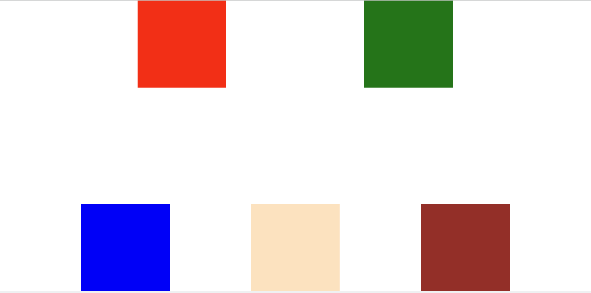

# credit_account

1. function `processTransactions` to process a list of transactions
   1. create credit account with credit limit
   1. charge amount (buy thing with borrow money)
   1. credit amount (pay back borrowed money)
   1. confirm account (check balance)
   1. report account (print out summary, see if there is any error)
1. function `summarizeAccounts` to summary all accounts

# test

1. run `npx vitest --ui`

# grid/flex css layout
1. see `index.html` and `style.css` for detail
1. to layout a div like this.
   

